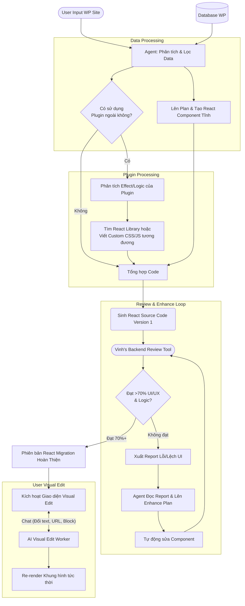

# Kế hoạch QA cho X-press MVP

Mục tiêu của kế hoạch này là đảm bảo chất lượng hệ thống migrate Wordpress sang React/Node.js bằng AI Agent, đáp ứng độ tương đồng UI/UX > 70% và verify toàn luồng xử lý của hệ thống.

## 1. Giai đoạn 1: Chuẩn bị Hạ tầng & Môi trường Kiểm thử (Blocker)
**Phụ trách:** Vinh & Infra team

- [ ] **Đồng bộ Database & Môi trường:**
  - Fix lỗi gọi sai Database: Cấu hình lại để khớp giữa site WordPress nguồn và Database đích.
  - Thống nhất Env Variables: Đảm bảo biến môi trường đồng bộ để deploy trơn tru lên VPS.
- [ ] **Setup Test Environment (VPS & Domain):**
  - Thực hiện deploy bản build lên VPS với domain test.
- [ ] **Chuẩn bị Dữ liệu Test (Test Data):**
  - Tạo / Thu thập ít nhất **10 template/site WordPress mẫu** có độ phức tạp từ cơ bản đến nâng cao (ưu tiên các site có dùng plugin phổ biến).

## 2. Giai đoạn 2: Kiểm thử Năng lực Core AI Agent (AI Workflow Testing)
**Phụ trách:** LA (AI Team) & QA

- [ ] **Đánh giá luồng AI "Plan & Gen Code":** (Đã xong, cần pass regression)
  - Verify AI lấy dữ liệu từ Database (không crawl UI HTML) để render sang React.
- [ ] **Đánh giá luồng xử lý Plugin (Mới - Cần thiết kế workflow):**
  - Verify AI có khả năng map các plugin effect phổ biến của WP sang các React component/library tương ứng.
- [ ] **Đánh giá luồng Review & Enhance Plan:**
  - Verify AI Agent tương tác đúng với tool đánh giá của Vinh (Backend).
  - Verify AI sinh ra "Enhance Plan" dựa trên kết quả review.

## 3. Giai đoạn 3: Kiểm thử Khả năng Visual Edit qua Chat (UX/Functional Testing)
**Phụ trách:** QA / PM / Dev

Thực hiện test các kịch bản tương tác người dùng - AI:
- [ ] **Chỉnh sửa Text/Content:** Yêu cầu đổi text một phần và toàn màn hình.
- [ ] **Chỉnh sửa Style/Theme:** Đổi topic trang, đổi màu sắc chủ đạo, font chữ.
- [ ] **Thêm/Bớt Component:** Yêu cầu chat thêm block (ví dụ: "Thêm phần review khách hàng vào dưới banner").
- [ ] **Chỉnh sửa Media/Hình ảnh:** Yêu cầu đổi URL hình gốc, thay đổi size ảnh, thay hình tĩnh.

## 4. Giai đoạn 4: Đánh giá & Nghiệm thu (Metrics & Acceptance)
- [ ] **Chạy Tool Metric Đánh giá Backend của Vinh:** Chấm điểm % code generated.
- [ ] **Manual Test UI/UX:** So sánh UI/UX giữa WP gốc và React Site sinh ra (phải đạt > 70%).

---

## 5. Sơ đồ Workflow: AI Xử Lý Plugin & Enhance Plan

